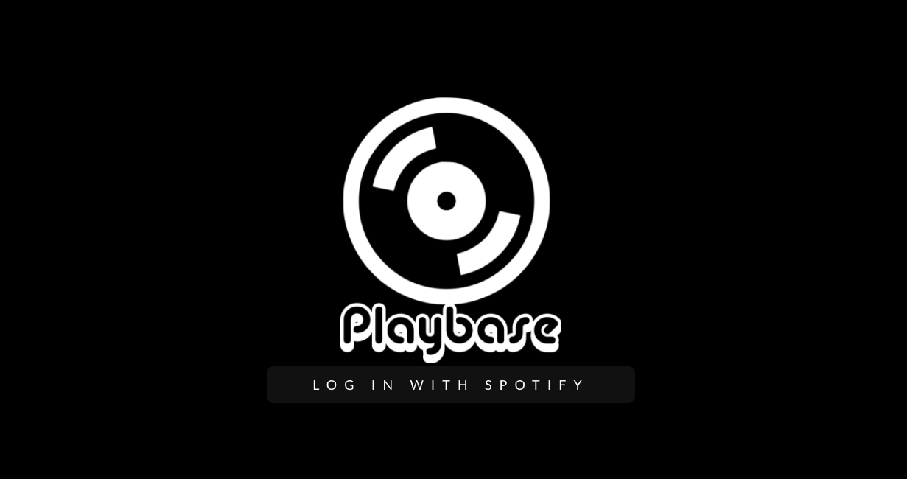

# Welcome to Playbase

A visually pleasing listening environment for Spotify. Search for albums, add to your collection, flip through your virtual shelf, and listen- all in the Playbase app!

### Motivation

We wanted to build an app that created an 'analog' feel for listening to your favorite albums on Spotify. Flipping through records is a very satisfying, and we aimed to recreate the experience with this application

### Built With

#### Backend

* Ruby [2.6.1]
* Rails [6.0.3]
* PostgreSQL v13, gem [1.2.3]
* OAuth [0.5.1]

#### Frontend

* React [16.13.1]
* Semantic UI React [1.3.1]
* Custom SASS/CSS

### Executing the Program

Fork and clone the Playbase repo  
Navigate to /playbase_backend
Run bundle install  
Run rails db:migrate  
Run rails s to start the server
In a new terminal (keep the backend server running!)
Navigate to /playbase
Run npm start and type 'y' to start the frontend server in a new port

## API, How To Use, and Credits
### API Reference

Playbase uses the Spotify API and Spotify OAuth for authentication.

### How To Use

Begin the program by following the installation instructions above.  

Once started, login with Spotify. You must have a Spotify Premium account to use Playbase.

Get started by searching for albums. 

Click 'Add to Shelf' to add an album to your collection.

From the home page, flip through your albums.

Listen by clicking 'Play'.

Remove albums from your shelf by clicking 'Remove'.  

### Credits

created by github users @allene-norton and @aks2258  

### License

##Learn.co Educational Content License

Copyright (c) 2015 Flatiron School, Inc

The Flatiron School, Inc. owns this Educational Content. However, the Flatiron School supports the development and availability of educational materials in the public domain. Therefore, the Flatiron School grants Users of the Flatiron Educational Content set forth in this repository certain rights to reuse, build upon and share such Educational Content subject to the terms of the Educational Content License set forth here (http://learn.co/content-license). You must read carefully the terms and conditions contained in the Educational Content License as such terms govern access to and use of the Educational Content.

Flatiron School is willing to allow you access to and use of the Educational Content only on the condition that you accept all of the terms and conditions contained in the Educational Content License set forth here (http://learn.co/content-license). By accessing and/or using the Educational Content, you are agreeing to all of the terms and conditions contained in the Educational Content License. If you do not agree to any or all of the terms of the Educational Content License, you are prohibited from accessing, reviewing or using in any way the Educational Content.
